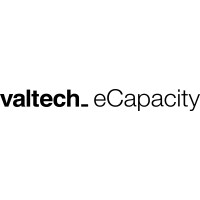

# Experience
---

    

        

            

                <h2> Student Data Science Consultant </h2>
                <h4> Valtech_eCapacity, <i>2021 - present</i> </h4>
            

            
        

        
<i class="fa fa-angle-down"></i>

        

            

                I work as part of the Data Science/Engineering team providing
                insights to companies by analyzing their customer data. Main
                technologies that i use include Python, Google Cloud Platform,
                Adobe Analytics, and SQL.
            

        

    

    

        

            

                <h2> Python, R, and Matlab TA </h2>
                <h4> Technical University of Denmark, <i>2019 - present</i> </h4>
            

            
        

        
<i class="fa fa-angle-down"></i>

        

            

                Spent multiple semesters as a teaching assistant in an introductory
                programming course. The focus was on data processing and general
                algorithmic thinking.
            

        

    

    

        

            

                <h2> Junior Developer </h2>
                <h4> FoodInfo, <i>2017 - 2019</i> </h4>
            

            
        

        
<i class="fa fa-angle-down"></i>

        

            

                Developed a prototype app using the Ionic framework. The app
                served nutrition information and relevant offers from nearby
                stores using the FoodInfo API.
            

        

    

# Projects
---

    

        

            

                <h2> YOLO real-time helmet detection </h2>
                <h4> Technical University of Denmark, <i>Fall 2021</i> </h4>
            

            
        

        
<i class="fa fa-angle-down"></i>

        

            

                Dummy card-text
                Dummy card-text
                Dummy card-text
            

        

    

    

        

            

                <h2> Jewellery Recommendation System for e-Commerce using CBIR </h2>
                <h4> Technical University of Denmark, <i>Spring 2021</i> </h4>
            

            
        

        
<i class="fa fa-angle-down"></i>

        

            

                Dummy card-text
                Dummy card-text
                Dummy card-text
            

        

    

    

        

            

                <h2> Multi Agent Q-Learning </h2>
                <h4> Technical University of Denmark, <i>Spring 2020</i> </h4>
            

            
        

        
<i class="fa fa-angle-down"></i>

        

            

                Dummy card-text
                Dummy card-text
                Dummy card-text
            

        

    

# Education
---

    

        

            

                <h2> BSc. Artificial Intelligence and Data </h2>
                <h4> Technical University of Denmark, <i>2019 - 2022</i> </h4>
            

            
        

    

